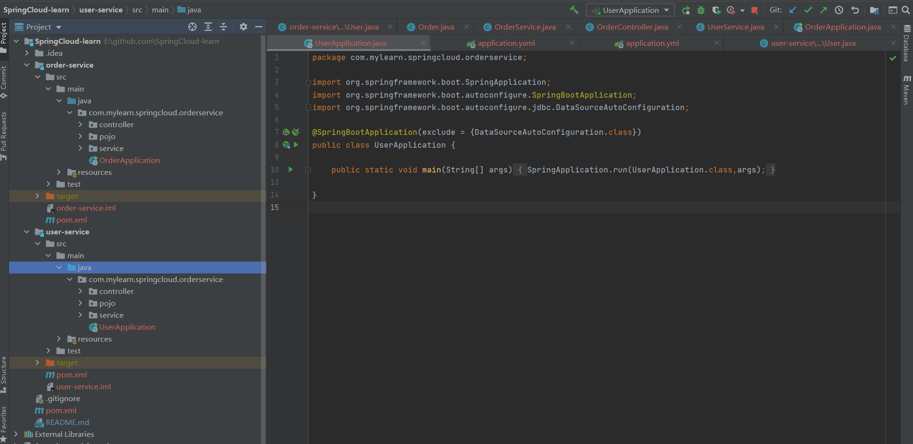
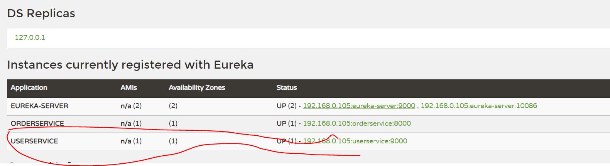
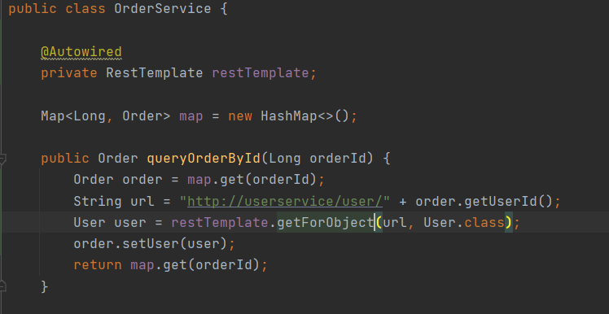

# SpringCloud总结

# 1. 服务架构对比

## 1. 1 单体架构

**单体架构：**将所有功能都集中在一个项目中开发，打成一个包部署。


优点：部署成本低，架构简单

缺点：耦合度高，维护、升级困难

## 1.2 分布式架构

**分布式架构：**根据业务功能对系统做拆分，每个业务功能模块作为一个独立项目开发，称为一个服务


优点：降低服务耦合、有利于服务升级和拓展

缺点：服务调用关系错综复杂

## 1.3 微服务架构


微服务实际是一种良好架构设计的**分布式架构方案**

微服务架构特征：

- 单一职责：微服务拆分粒度更小，每个微服务对应唯一的业务能力
- 自治: 团队独立、技术独立、数据独立，独立部署和交付
- 面向服务：服务统一标准的接口，与语言和技术无关
- 隔离性强：服务调用做好隔离、容错 、降级，避免出现级联关系

微服务在Java领域最引人注目的就是Spring Cloud提供的方案了。

## 1.4 SpringCloud

SpringCloud常见的组件包括：


# 2. 服务拆分和远程调用

## 2.1 服务拆分

现模拟一个微服务demo，用户服务和订单服务

cloud-demo: 父工厂，管理依赖

- order-service：订单微服务，负责订单相关业务
- user-service: 用户微服务，负责用户相关业务

要求：

- 订单微服务和用户微服务都必须有自己的数据库（为了简化，模拟数据库），相互独立
- 订单服务和用户服务都对外暴露Restful接口

代码请参考仓库第一次提交:



## 2.2 实现远程调用

### 2.2.1 案例需求

查询订单时，将订单用户也一同查询出。

```java
import org.springframework.boot.SpringApplication;
import org.springframework.boot.autoconfigure.SpringBootApplication;
import org.springframework.boot.autoconfigure.jdbc.DataSourceAutoConfiguration;
import org.springframework.context.annotation.Bean;
import org.springframework.web.client.RestTemplate;

@SpringBootApplication(exclude = {DataSourceAutoConfiguration.class})
public class OrderApplication {
    public static void main(String[] args) {
        SpringApplication.run(OrderApplication.class);
    }

    @Bean
    public RestTemplate restTemplate() {
        return new RestTemplate();
    }
}

```

### 2.2.2 实现远程调用

```java
import com.mylearn.springcloud.orderservice.pojo.Order;
import com.mylearn.springcloud.orderservice.pojo.User;
import com.mylearn.springcloud.orderservice.service.OrderService;
import org.springframework.beans.factory.annotation.Autowired;
import org.springframework.web.bind.annotation.GetMapping;
import org.springframework.web.bind.annotation.PathVariable;
import org.springframework.web.bind.annotation.RequestMapping;
import org.springframework.web.bind.annotation.RestController;
import org.springframework.web.client.RestTemplate;

@RestController
@RequestMapping("order")
public class OrderController {

    @Autowired
    private OrderService orderService;

    @Autowired
    private RestTemplate restTemplate;

    @GetMapping("{orderId}")
    public Order getOrder(@PathVariable("orderId") Long orderId) {
        Order order = orderService.queryOrderById(orderId);

        String url = "http://localhost:9000/user/" + order.getUserId();
        User user = restTemplate.getForObject(url, User.class);
        order.setUser(user);

        return order;
    }
}

```

# 3. Eureka注册中心

问题：

- 在order-service在发起调用时，该如何得知user-service实例的ip地址和端口
- 有多个user-service实例地址，order-service调用时该如何选择？
- order-service如何得知某个user-service实例是否依然健康，是不是已经宕机？

## 3.1 Eureka的结构和作用


问题1：order-service如何得知user-service实例地址？

获取地址信息的流程如下：

- user-service服务实例启动后，将自己的信息注册到eureka-server（Eureka服务端）。这个叫服务注册
- eureka-server保存服务名称到服务实例地址列表的映射关系
- order-service根据服务名称，拉取实例地址列表。这个叫服务发现或服务拉取

问题2：order-service如何从多个user-service实例中选择具体的实例？

- order-service从实例列表中利用负载均衡算法选中一个实例地址
- 向该实例地址发起远程调用

问题3：order-service如何得知某个user-service实例是否依然健康，是不是已经宕机？

- user-service会每隔一段时间（默认30秒）向eureka-server发起请求，报告自己状态，称为心跳
- 当超过一定时间没有发送心跳时，eureka-server会认为微服务实例故障，将该实例从服务列表中剔除
- order-service拉取服务时，就能将故障实例排除了

因此，接下来我们动手实践的步骤包括：


## 3.2 搭建eureka-server服务

1. 引入eureka-server依赖

   引入SpringCloud为eureka-server提供的starter依赖：

   ```xml
   <dependency>
       <groupId>org.springframework.cloud</groupId>
       <artifactId>spring-cloud-starter-netflix-eureka-server</artifactId>
   </dependency>
   ```

2. 编写启动类

   给eureka-server服务启动一个启动类，一定要添加一个@EnableEurekaServer注解，开启eureka的注册中心功能：

   ```java
   package cn.itcast.eureka;
   
   import org.springframework.boot.SpringApplication;
   import org.springframework.boot.autoconfigure.SpringBootApplication;
   import org.springframework.cloud.netflix.eureka.server.EnableEurekaServer;
   
   @SpringBootApplication
   @EnableEurekaServer
   public class EurekaApplication {
       public static void main(String[] args) {
           SpringApplication.run(EurekaApplication.class, args);
       }
   }
   ```

3. 编写配置文件

   编写一个application.yaml文件，内容如下:

   ```yaml
   server:
     port: 10086
   spring:
     application:
       name: eureka-server
   eureka:
     client:
       service-url: 
         defaultZone: http://127.0.0.1:10086/eureka
   ```

4. 启动服务

   启动服务，然后在浏览器访问： http://127.0.0.1:10086

## 3.3 服务注册

注册中心搭建完了，我们开始注册服务：将user-service注册到服务中心

1. 引入依赖：在user-service的pom.xml文件中，引入下面的依赖

   ```yaml
   <dependency>
       <groupId>org.springframework.cloud</groupId>
       <artifactId>spring-cloud-starter-netflix-eureka-client</artifactId>
   </dependency>
   ```

2. 配置文件

   在user-service中，修改application.yaml文件，添加服务名称、eureka地址

   ```
   spring:
     application:
       name: userservice
   eureka:
     client:
       service-url:
         defaultZone: http://127.0.0.1:10086/eureka
   ```

3. 启动服务，在注册中心可以查看到

   

## 3.4 服务发现

接着，我们将order-service的逻辑修改：向eureka-server拉取user-service的信息，实现服务发现

1. 引入依赖

   在order-service的pom文件中，引入下面的eureka-client依赖

   ```xml
   <dependency>
       <groupId>org.springframework.cloud</groupId>
       <artifactId>spring-cloud-starter-netflix-eureka-client</artifactId>
   </dependency>
   ```

2. 配置文件：添加服务名称、eureka地址

   ```yaml
   spring:
     application:
       name: orderservice
   eureka:
     client:
       service-url:
         defaultZone: http://127.0.0.1:10086/eureka
   ```

3. 服务拉取和负载均衡

   在order-service的OrderApplication中，给RestTemplate这个Bean添加一个@LoadBalanced注解，便可实现**服务拉取**和**负载均衡**

   

4. 修改获取user的代码

   

   
